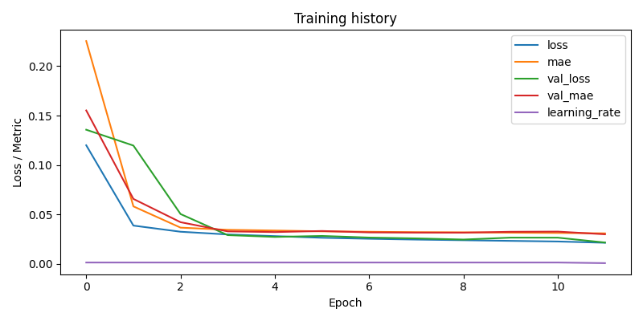

# Image Restoration: comparing deep learning models on damaged documents

Can a neural network clean up a scanned document that has a stamp on it, is blurry, noisy, or partly covered? This project builds a small, reproducible pipeline to answer that: it generates damaged images with OpenCV, trains several restoration models on them, and tunes their hyperparameters.


*Six images from the test set (never seen during training). Left: the damaged input. Right: the clean target. In between: what each model produced.*

## What's in it

- **Synthetic data generator** (OpenCV): draws random digits on a paper-like background, then damages them with a semi-transparent stamp, blur, a covered rectangle and pixel noise. Each sample is a pair (damaged image, clean image), so no manual labeling is needed.
- **Five models** behind one command line:
  - `cnn`: a residual CNN, the simple baseline.
  - `unet`: an encoder-decoder with skip connections.
  - `mwcnn`: a multi-level wavelet CNN (Haar transform), with a wavelet-based loss.
  - `unet_gan`: a U-Net generator with a PatchGAN discriminator (pix2pix style).
  - `vit`: a small Vision Transformer with a convolutional decoder.
- **Custom losses**: a weighted MSE + SSIM loss that puts more weight on the ink (dark pixels), so the model doesn't just learn to paint everything paper-colored.
- **Hyperparameter tuning**: random search or grid search from a YAML file. Each trial is a full training run, ranked by SSIM.
- **Metrics**: PSNR, SSIM and MAE, plus side-by-side comparison images and loss curves for every experiment.

| Folder | What it does |
|---|---|
| [`run.py`](run.py) | Single entry point: `generate`, `train`, `evaluate`, `tune` |
| [`src/data_generator.py`](src/data_generator.py) | The synthetic damaged/clean image pairs |
| [`src/models/`](src/models) | The five models |
| [`src/losses.py`](src/losses.py), [`src/metrics.py`](src/metrics.py) | Losses and PSNR/SSIM/MAE |
| [`tuning/`](tuning) | Random and grid search, the tuning loop |
| [`configs/`](configs) | Search spaces in YAML |
| [`show_results.py`](show_results.py) | Prints a ranked table of tuning trials |

## Results

Trained on 3,000 generated images (96×96, all damage types at once), 10% kept aside for validation. Scored on a **separate test set of 300 images** generated afterwards. Everything ran on a CPU, so the runs are short (8 to 12 epochs).

| Model | Parameters | PSNR (dB) ↑ | SSIM ↑ | MAE ↓ |
|---|---|---|---|---|
| Damaged input (no model) | | 19.86 | 0.462 | 0.0589 |
| CNN | 113 K | 24.09 | 0.960 | 0.0322 |
| U-Net, first run | 7.8 M | 17.38 | 0.949 | 0.0481 |
| **U-Net, tuned** | 1.9 M | **24.59** | **0.966** | 0.0313 |
| MWCNN | 1.7 M | 23.96 | 0.947 | **0.0309** |

What I take from this:

- **All models remove the stamp, the noise and most of the blur.** SSIM goes from 0.46 to about 0.95-0.97.
- **Tuning made the difference for the U-Net.** The first U-Net left a black stripe on the left edge of every image (see the third column above). Inside the image it was fine, but those two dark columns pulled its PSNR down to 17.4 dB. The tuned version is 4 times smaller, has no stripe and is the best model overall. We did not find the exact cause of the stripe; the MWCNN also leaves a faint dotted line on its bottom edge.
- **The small CNN is a strong baseline.** With 113 K parameters it is close to the bigger models on this simple data.
- **Covered parts can't be recovered.** When the gray rectangle hides most of a digit (the "9" in the second row, the "3" in the fifth), no model can know what was there. They erase the rectangle and keep only the visible strokes. This is a limit of the task, not of one model.

### Hyperparameter tuning

Random search over the U-Net: 6 trials of 2 epochs each, ranked by SSIM on the validation set.

| Rank | SSIM | PSNR | Learning rate | Batch | Filters | Dropout | Ink weight | MSE weight |
|---|---|---|---|---|---|---|---|---|
| 1 | 0.836 | 16.84 | 0.0012 | 16 | 16 | 0.24 | 2 | 0.5 |
| 2 | 0.826 | 16.25 | 0.0016 | 16 | 32 | 0.21 | 2 | 0.7 |
| 3 | 0.822 | 16.18 | 0.0020 | 16 | 32 | 0.11 | 2 | 0.3 |
| 4 | 0.815 | 16.00 | 0.0018 | 16 | 32 | 0.15 | 8 | 0.3 |
| 5 | 0.813 | 15.90 | 0.0016 | 16 | 16 | 0.24 | 4 | 0.3 |
| 6 | 0.809 | 15.23 | 0.0005 | 32 | 16 | 0.12 | 4 | 0.5 |

Two epochs is short, so these scores are low and only useful to compare trials with each other. Still, a pattern shows up: the three best trials all use the lowest ink weight (2), and the slowest setup (low learning rate, batch 32) came last. The best configuration was then trained for 12 epochs, which gave the "U-Net, tuned" row above.



## Bugs found and fixed while re-running the project

Running everything from scratch for this repo turned up a few problems in the original code:

- **The final score was computed on training images.** After training, the trainer evaluated the model on the first 200 images of the dataset, which were part of the training set, so the scores looked better than they were. It now uses the validation part (the last 10%), and the table above uses a separate test set.
- **The comparison image didn't show the evaluated images.** Fixed so it shows the same images that were scored.
- **`evaluate` could never find the weights.** It looked for `best_weights.h5`, but training saves `best_weights.weights.h5`.
- **`--base_filters` was ignored for the CNN**, and the command saved by the tuner (`best_command.sh`) used `--ink_weight` and `--mse_alpha` options that `train` didn't accept. Both fixed.
- **The two loss weights didn't add up to 1.** The SSIM weight was always 0.5, whatever the MSE weight. It is now `1 - mse_weight`. (The tuning table above was run before this fix.)

## How to run

```bash
pip install -r requirements.txt

# 1. generate data (training set, then a separate test set)
python run.py generate --num_samples 3000 --img_size 96 --corruption all --output data/synthetic
python run.py generate --num_samples 300  --img_size 96 --corruption all --output data/test

# 2. train a model
python run.py train --model cnn --dataset data/synthetic --img_size 96 --epochs 8 \
  --batch_size 16 --lr 0.001 --base_filters 32 --exp_name final_cnn

# 3. score it on the test set
python run.py evaluate --exp experiments/final_cnn/ --dataset data/test --n_eval 300

# 4. tune the U-Net, then show the ranked trials
python run.py tune --config configs/tune_unet_portfolio.yaml --model unet --trials 6 \
  --tune_epochs 2 --tuning_name tune_unet
python show_results.py experiments/tuning/tune_unet/results.json
```

Data, trained weights and experiment folders are not in the repo; the commands above recreate them. A GPU is used automatically if TensorFlow finds one. More detail on every option (in French) is in [docs/README_fr.md](docs/README_fr.md).

## Limitations

- **Synthetic data only.** The images are generated digits, not real scanned documents. The models would need real examples (or more realistic damage) to work on actual scans.
- **Short CPU training.** 8 to 12 epochs per model and 6 tuning trials. Longer runs on a GPU would likely change the ranking a little.
- **The GAN and the ViT were not part of this final comparison.** Their code is here, but they are much slower to train on a CPU, so I didn't train them for this comparison.
- **Covered regions are lost**, as shown above.

## Tech

Python, TensorFlow / Keras, OpenCV, NumPy, Matplotlib, PyYAML.

## Credits

A two-person project made with **Mohamed Beldi**. My part was researching which restoration models to try and running part of the hyperparameter tuning.
