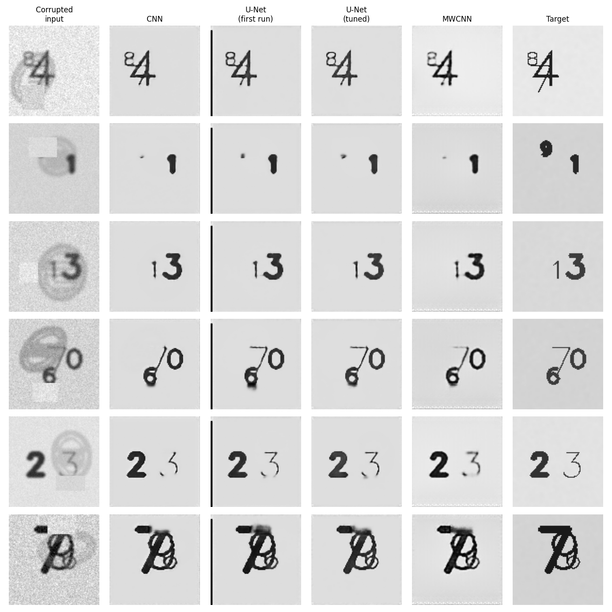

# Image Restoration: comparing deep learning models on damaged documents

Can a neural network clean up a scanned document that has a stamp on it, is blurry, noisy, or partly covered? This project builds a small, reproducible pipeline to answer that: it generates damaged images with OpenCV, trains several restoration models on them, and tunes their hyperparameters.

*Six images from the test set (never seen during training). Left: the damaged input. Right: the clean target. In between: what each model produced.*

## What's in it

- **Synthetic data generator** (OpenCV): draws random digits on a paper-like background, then damages them with a semi-transparent stamp, blur, a covered rectangle and pixel noise. Each sample is a pair (damaged image, clean image), so no manual labeling is needed.
- **Five models** behind one command line:
  - `cnn`: a residual CNN, the simple baseline.
  - `unet`: an encoder-decoder with skip connections.
- **The GAN and the ViT were not part of this final comparison.** Their code is here, but they are much slower to train on a CPU, so I didn't train them for this comparison.
- **Covered regions are lost**, as shown above.

## Tech

Python, TensorFlow / Keras, OpenCV, NumPy, Matplotlib, PyYAML.

## Credits

A two-person project made with **Mohamed Beldi**. My part was researching which restoration models to try and running part of the hyperparameter tuning.
